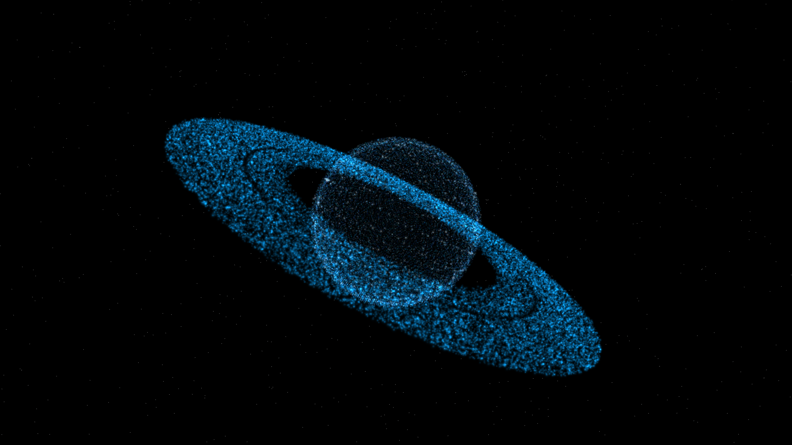
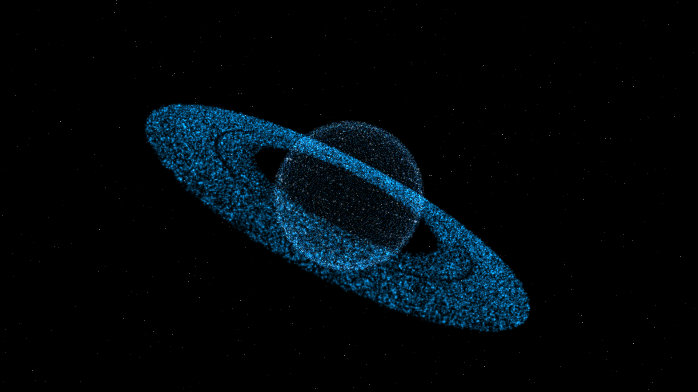

# Saturn Hand Tracking System

A browser-based interactive 3D Saturn demo with real-time hand tracking via webcam.

## Screenshots

<p align="center">
  
  
</p>
<p align="center">
  
  
</p>

## Features

- **3D Particle Saturn** — planet and ring system built from 68,000+ particles using Three.js custom shaders
- **Hand Tracking** — powered by MediaPipe Hands, runs entirely in the browser with no backend
- **Open Hand** → Saturn follows palm position in world space
- **Pinch (lock)** → rotate Saturn by moving your hand
- **Single-hand depth scaling** → move hand closer/further from camera to zoom in/out
- **Fist gesture** → ring and planet particles implode into a black hole, then re-expand when hand opens
- **Webcam preview** — live facecam pinned to bottom-right corner
- **Hand skeleton overlay** — landmark skeleton drawn on a fullscreen canvas

## Tech Stack

- [Three.js](https://threejs.org/) — 3D rendering, custom GLSL shaders, additive particle blending
- [MediaPipe Hands](https://developers.google.com/mediapipe/solutions/vision/hand_landmarker) — real-time hand landmark detection
- Vanilla JS (ES Modules) — no build step required

## Getting Started

1. Clone the repo:
   ```bash
   git clone https://github.com/ramazanduru2011-oss/Saturn-Hand-Tracking-system.git
   cd Saturn-Hand-Tracking-system
   ```

2. Serve locally (a local server is required for ES module imports):
   ```bash
   python -m http.server 3333
   ```

3. Open **http://localhost:3333** in Chrome and allow camera access when prompted.

## Controls

| Gesture | Action |
|---|---|
| Open hand visible | Saturn follows palm · particle repulsion active |
| Move hand closer/further | Zoom in / zoom out |
| Pinch (thumb + index) | Lock and rotate Saturn |
| Fist | Ring implosion effect |

## Project Structure

```
index.html   — entry point, loads MediaPipe CDN scripts
main.js      — Three.js scene, shaders, particle system, interaction loop
hands.js     — MediaPipe hand tracking, gesture detection, overlay drawing
style.css    — layout, webcam preview, hand canvas, status badge
```
